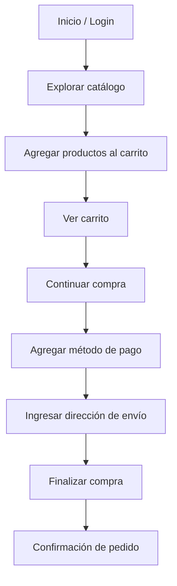

# [ROES](https://roescr.com/)

## Propósito del sistema

ROES es un almacén físico que implementó un **e-commerce** para ofrecer a sus clientes la posibilidad de adquirir productos en línea desde cualquier parte de Costa Rica, ampliando la accesibilidad y conveniencia de sus servicios.

### ¿Qué problema resuelve?

Facilita la compra en línea a los clientes que no pueden o no desean desplazarse hasta una de las tiendas físicas de ROES.

### ¿Cuál es su público objetivo?

Personas en Costa Rica interesadas en adquirir productos como línea blanca, teléfonos, muebles, electrodomésticos, colchones, bicicletas y artículos tecnológicos.

### ¿Cuál es el flujo?

## Lista de chequeo
[Ver lista de chequeo completa](./Lista-de-chequeo-Tarea1.md)