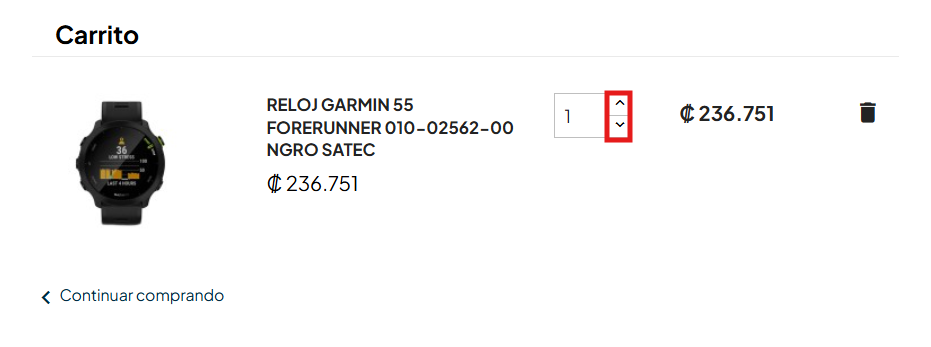

# 🐞 Reporte de Bug

## ID  
**BUG-C001**

## Título  
**Carrito de compra - El botón para incrementar productos debe tener texto visible**

## Estado  
- [x] Nuevo  
- [ ] En revisión  
- [ ] En desarrollo  
- [ ] Resuelto  
- [ ] Cerrado  

## Reportado por  
**Daniel Pérez Morera**

## Fecha de detección  
**2025-10-22**

## Prioridad  
- ⚪ **Baja** (estética o detalle menor)

## Descripción  
El botón que se utiliza para aumentar o disminuir la cantidad de un producto en el carrito no contiene texto o etiqueta visible (*label*) que describa su función.  
Este error afecta la accesibilidad del sitio, ya que las herramientas lectoras de pantalla no pueden identificar correctamente la acción del botón.  

**Error detectado:** “Los botones deben tener texto discernible” (*Buttons must have discernible text*).

## Pasos para reproducir  
1. Iniciar sesión con un usuario válido.  
2. Agregar un producto al carrito.  
3. Hacer clic en el carrito y luego en `Ver Carrito`.  
4. Observar los botones para aumentar o disminuir la cantidad del producto.

## Resultado esperado  
Los botones para aumentar o disminuir la cantidad de un producto deben incluir un texto o etiqueta accesible que describa claramente su función (por ejemplo: “Aumentar cantidad” / “Disminuir cantidad”).

## Resultado obtenido  
Los botones para aumentar o disminuir la cantidad no tienen un texto o etiqueta accesible que indique su función.

## Evidencia  
- **Captura de pantalla:**  
    
- **Ticket de `Axe Dev Tools`:**  
  [Ver en Axe Dev Tools](https://axe.deque.com/axe-devtools/tests/4cd20fdc-3a51-4d74-859f-f8cd263460cd/issues?configNeedsReview=disabled&configBestPractices=enabled&configAccessibilityStandard=wcag21aa&configAdvancedRules=enabled&issueIndex=1&ruleId=button-name)

## Entorno de pruebas  
- **Navegador:** Microsoft Edge 141  
- **Dispositivo:** Escritorio  
- **Sistema operativo:** Windows 11  
- **URL o versión del sistema:** [https://roescr.com/carrito?action=show](https://roescr.com/carrito?action=show)

## Notas adicionales  
Se recomienda agregar etiquetas accesibles (`aria-label` o texto visible) para cumplir con los criterios de accesibilidad **WCAG 2.1 Nivel AA**, específicamente la regla **button-name**.
