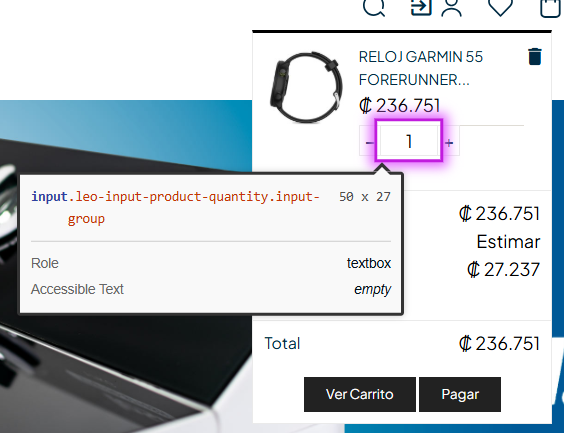

# 🐞 Reporte de Bug

## ID  
**BUG-C002**

## Título  
**Carrito de compra rápida - El campo de cantidad debe tener etiqueta accesible**

## Estado  
- [x] Nuevo  
- [ ] En revisión  
- [ ] En desarrollo  
- [ ] Resuelto  
- [ ] Cerrado  

## Reportado por  
**Daniel Pérez Morera**

## Fecha de detección  
**2025-10-22**

## Prioridad  
- ⚪ **Baja** (estética o detalle menor)

## Descripción  
El campo numérico que permite seleccionar la cantidad de artículos disponibles en el carrito de compra rápida no tiene una etiqueta o descripción accesible.  
Esto impide que las herramientas lectoras de pantalla identifiquen correctamente la función del campo, afectando la accesibilidad del sitio.

**Error detectado:** El campo del formulario debe tener una etiqueta discernible.

## Pasos para reproducir  
1. Iniciar sesión con un usuario válido.  
2. Agregar un producto al carrito.  
3. Hacer clic en el carrito para abrir el carrito de compra rápida.  
4. Observar el campo donde se indica la cantidad de artículos (por ejemplo, el número “1”, “2”, “3”, etc.).

## Resultado esperado  
El campo de cantidad debe incluir una etiqueta visible o un atributo accesible que describa su propósito.

## Resultado obtenido  
El campo de cantidad no tiene una etiqueta visible ni un atributo accesible que indique su función.

## Evidencia  
- **Capturas de pantalla:**  
    
- **Tiquetes de `Axe Dev Tools`:**  
  [Tiquete 1](https://axe.deque.com/issues/3a7ada27-114f-4607-98cb-326e29e970ad)

## Entorno de pruebas  
- **Navegador:** Microsoft Edge 141  
- **Dispositivo:** Escritorio  
- **Sistema operativo:** Windows 11  
- **URL o versión del sistema:** [https://roescr.com/](https://roescr.com/)

## Notas adicionales  
Se recomienda agregar una etiqueta visible o un atributo `aria-label` al campo de cantidad de productos para cumplir con los criterios de accesibilidad **WCAG 2.1 Nivel AA**, específicamente la regla **form-field-must-have-label**.
