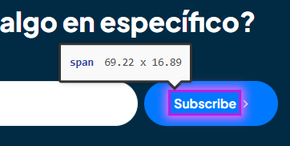

# 🐞 Reporte de Bug

## ID  
**BUG-C003**

## Título  
**Carrito de compra - El botón de Suscribirse debe tener contraste con el fondo**

## Estado  
- [x] Nuevo  
- [ ] En revisión  
- [ ] En desarrollo  
- [ ] Resuelto  
- [ ] Cerrado  

## Reportado por  
**Daniel Pérez Morera**

## Fecha de detección  
**2025-10-22**

## Prioridad  
- ⚪ **Baja** (estética o detalle menor)

## Descripción  
El botón de Suscribirse al final de la pantalla debe tener un contraste adecuado con el fondo.  
Actualmente, el color del botón es muy similar al del fondo, lo que dificulta su visibilidad y afecta la accesibilidad del sitio.

**Error detectado:** El contraste entre el texto y el fondo no cumple con los estándares de accesibilidad.

## Pasos para reproducir  
1. Iniciar sesión con un usuario válido.  
2. Agregar un producto al carrito.  
3. Hacer clic en el carrito y luego en `Ver Carrito`.  
4. Observar al final de la página el botón de `Suscribirse`.

## Resultado esperado  
El botón de Suscribirse debe tener un contraste suficiente con el fondo para ser claramente visible.

## Resultado obtenido  
El botón tiene un contraste muy bajo con el fondo, dificultando su lectura y visibilidad.

## Evidencia  
- **Capturas de pantalla:**  
    
- **Tiquetes de `Axe Dev Tools`:**  
  - [Tiquete 1](https://axe.deque.com/issues/29ffa53c-ca40-4da7-b139-62bc83b51750)

## Entorno de pruebas  
- **Navegador:** Microsoft Edge 141  
- **Dispositivo:** Escritorio  
- **Sistema operativo:** Windows 11  
- **URL o versión del sistema:** [https://roescr.com/carrito?action=show](https://roescr.com/carrito?action=show)

## Notas adicionales  
Se recomienda ajustar el color del botón o del texto para cumplir con los criterios de accesibilidad **WCAG 2.1 Nivel AA**, específicamente la regla de contraste de color.
