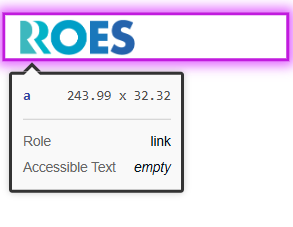
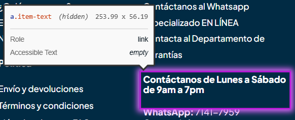
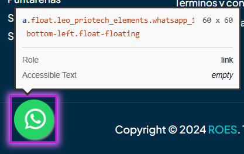

# 🐞 Reporte de Bug

## ID  
**BUG-C004**

## Título  
**Carrito de compra - Los enlaces deben tener textos legibles**

## Estado  
- [x] Nuevo  
- [ ] En revisión  
- [ ] En desarrollo  
- [ ] Resuelto  
- [ ] Cerrado  

## Reportado por  
**Daniel Pérez Morera**

## Fecha de detección  
**2025-10-22**

## Prioridad  
- ⚪ **Baja** (estética o detalle menor)

## Descripción  
Algunos enlaces, como el del logo principal, el de WhatsApp y el de contacto, no contienen texto legible, lo que dificulta su identificación y afecta la accesibilidad del sitio.

**Error detectado:** Los enlaces deben contener texto legible.

## Pasos para reproducir  
1. Iniciar sesión con un usuario válido.  
2. Agregar un producto al carrito.  
3. Hacer clic en el carrito y luego en `Ver Carrito`.  
4. Observar los enlaces del sitio, incluyendo el logo, WhatsApp y contacto.

## Resultado esperado  
Todos los enlaces deben contener texto legible que describa su función.

## Resultado obtenido  
Varios enlaces no contienen texto legible, dificultando su uso y accesibilidad.

## Evidencia  
- **Capturas de pantalla:**  
    
    
    
- **Tiquetes de `Axe Dev Tools`:**  
  - [Tiquete 1](https://axe.deque.com/issues/a4aa9419-7afb-489a-8d52-a0ea020be631)  
  - [Tiquete 2](https://axe.deque.com/issues/6bd98c03-f226-4493-8420-91a897e7228f)  
  - [Tiquete 3](https://axe.deque.com/issues/5058d00e-7b99-4f9e-beeb-2030f68675df)

## Entorno de pruebas  
- **Navegador:** Microsoft Edge 141  
- **Dispositivo:** Escritorio  
- **Sistema operativo:** Windows 11  
- **URL o versión del sistema:** [https://roescr.com/carrito?action=show](https://roescr.com/carrito?action=show)

## Notas adicionales  
Se recomienda agregar texto descriptivo a todos los enlaces para cumplir con los criterios de accesibilidad **WCAG 2.1 Nivel AA**, específicamente la regla de enlaces con texto legible.
