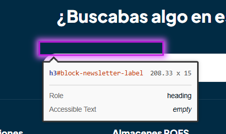

# 🐞 Reporte de Bug

## ID  
**BUG-C005**

## Título  
**Carrito de compra - Los encabezados no deben estar vacíos**

## Estado  
- [x] Nuevo  
- [ ] En revisión  
- [ ] En desarrollo  
- [ ] Resuelto  
- [ ] Cerrado  

## Reportado por  
**Daniel Pérez Morera**

## Fecha de detección  
**2025-10-22**

## Prioridad  
- ⚪ **Baja** (estética o detalle menor)

## Descripción  
Se ha detectado un encabezado vacío en el pie de página, lo que afecta la accesibilidad y la estructura semántica del sitio.

**Error detectado:** Encabezado (`header`) vacío en el pie de página.

## Pasos para reproducir  
1. Iniciar sesión con un usuario válido.  
2. Agregar un producto al carrito.  
3. Hacer clic en el carrito y luego en `Ver Carrito`.  
4. Ir al pie de página y observar los encabezados.

## Resultado esperado  
No debe haber ningún encabezado vacío en ninguna sección del sitio.

## Resultado obtenido  
Se encontró un encabezado vacío en el pie de página.

## Evidencia  
- **Capturas de pantalla:**  
    
- **Tiquetes de `Axe Dev Tools`:**  
  - [Tiquete 1](https://axe.deque.com/issues/65708b3a-2b49-47e4-921f-a3fab5d1ac2d)

## Entorno de pruebas  
- **Navegador:** Microsoft Edge 141  
- **Dispositivo:** Escritorio  
- **Sistema operativo:** Windows 11  
- **URL o versión del sistema:** [https://roescr.com/carrito?action=show](https://roescr.com/carrito?action=show)

## Notas adicionales  
Se recomienda revisar y completar todos los encabezados vacíos para cumplir con los criterios de accesibilidad **WCAG 2.1 Nivel AA**, asegurando que la estructura semántica del sitio sea correcta.
