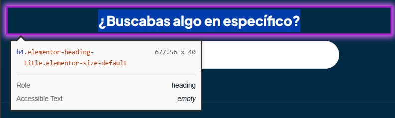

# 🐞 Reporte de Bug

## ID  
**BUG-C006**

## Título  
**Carrito de compra - El orden de los encabezados no es semánticamente correcto**

## Estado  
- [x] Nuevo  
- [ ] En revisión  
- [ ] En desarrollo  
- [ ] Resuelto  
- [ ] Cerrado  

## Reportado por  
**Daniel Pérez Morera**

## Fecha de detección  
**2025-10-22**

## Prioridad  
- ⚪ **Baja** (estética o detalle menor)

## Descripción  
Se ha detectado un encabezado que no sigue la estructura semántica correcta, lo que puede afectar la accesibilidad y la interpretación de la jerarquía de la página.

**Error detectado:** Encabezado semánticamente incorrecto en el pie de página.

## Pasos para reproducir  
1. Iniciar sesión con un usuario válido.  
2. Agregar un producto al carrito.  
3. Hacer clic en el carrito y luego en `Ver Carrito`.  
4. Ir al pie de página y observar el encabezado `¿Buscabas algo en específico?`.

## Resultado esperado  
Todos los encabezados deben seguir un orden semántico correcto y coherente con la jerarquía de la página.

## Resultado obtenido  
El encabezado del pie de página no sigue la jerarquía semántica adecuada.

## Evidencia  
- **Capturas de pantalla:**  
    
- **Tiquetes de `Axe Dev Tools`:**  
  - [Tiquete 1](https://axe.deque.com/issues/b291527a-54df-4e0e-bf36-97d48d5717af)

## Entorno de pruebas  
- **Navegador:** Microsoft Edge 141  
- **Dispositivo:** Escritorio  
- **Sistema operativo:** Windows 11  
- **URL o versión del sistema:** [https://roescr.com/carrito?action=show](https://roescr.com/carrito?action=show)

## Notas adicionales  
Se recomienda revisar y corregir la jerarquía de todos los encabezados para cumplir con los criterios de accesibilidad **WCAG 2.1 Nivel AA**, asegurando un orden semántico coherente.
