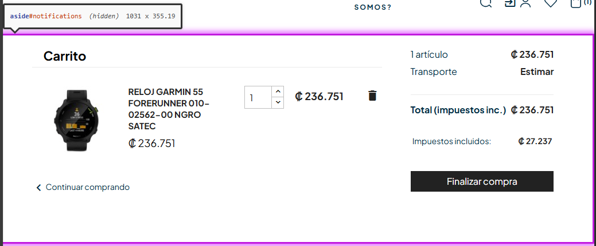

# 🐞 Reporte de Bug

## ID  
**BUG-C007**

## Título  
**Carrito de compra - Landmark complementario o ‘aside’ fuera de nivel superior**

## Estado  
- [x] Nuevo  
- [ ] En revisión  
- [ ] En desarrollo  
- [ ] Resuelto  
- [ ] Cerrado  

## Reportado por  
**Daniel Pérez Morera**

## Fecha de detección  
**2025-10-22**

## Prioridad  
- ⚪ **Baja** (estética o detalle menor)

## Descripción  
Todo `<aside>` o landmark complementario debe estar al nivel principal de la página, no dentro de otra sección o landmark, para que la navegación semántica funcione correctamente.  
Actualmente, se detectó un `<aside>` que está anidado dentro de otra sección, lo que puede afectar la navegación con lectores de pantalla.

**Error detectado:** Landmark complementario o `<aside>` fuera de nivel superior.

## Pasos para reproducir  
1. Iniciar sesión con un usuario válido.  
2. Agregar un producto al carrito.  
3. Hacer clic en el carrito y luego en `Ver Carrito`.  
4. Observar los `<aside>` o landmarks en la página.

## Resultado esperado  
Todos los `<aside>` o landmarks complementarios deben estar al nivel principal de la página, fuera de otras secciones, para asegurar una navegación semántica correcta.

## Resultado obtenido  
Se detecta al menos un `<aside>` que está anidado dentro de otra sección, incumpliendo la jerarquía semántica.

## Evidencia  
- **Capturas de pantalla:**  
    
- **Tiquetes de `Axe Dev Tools`:**  
  - [Tiquete 1](https://axe.deque.com/issues/d1baeaca-52e5-49b1-b3ef-3fd15daf7503)

## Entorno de pruebas  
- **Navegador:** Microsoft Edge 141  
- **Dispositivo:** Escritorio  
- **Sistema operativo:** Windows 11  
- **URL o versión del sistema:** [https://roescr.com/carrito?action=show](https://roescr.com/carrito?action=show)

## Notas adicionales  
Se recomienda mover todos los `<aside>` o landmarks complementarios al nivel principal de la página para cumplir con los criterios de accesibilidad **WCAG 2.1 Nivel AA**, asegurando una jerarquía semántica correcta.
