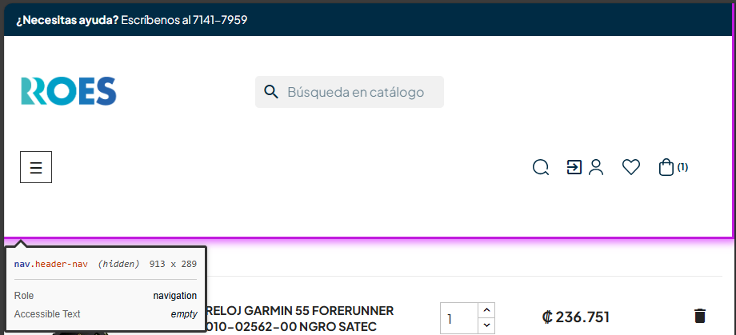

# 🐞 Reporte de Bug

## ID  
**BUG-C008**

## Título  
**Carrito de compra - Landmark no único**

## Estado  
- [x] Nuevo  
- [ ] En revisión  
- [ ] En desarrollo  
- [ ] Resuelto  
- [ ] Cerrado  

## Reportado por  
**Daniel Pérez Morera**

## Fecha de detección  
**2025-10-22**

## Prioridad  
- ⚪ **Baja** (estética o detalle menor)

## Descripción  
Se ha detectado un landmark que no es único en la página.  
Cada landmark debe tener una combinación única de rol y nombre accesible (role/label/title) para que los usuarios de lectores de pantalla puedan navegar correctamente entre las regiones del sitio.

**Error detectado:** Landmark con rol o nombre accesible duplicado, lo que puede generar confusión en la navegación.

## Pasos para reproducir  
1. Iniciar sesión con un usuario válido.  
2. Agregar un producto al carrito.  
3. Hacer clic en el carrito y luego en `Ver Carrito`.  
4. Observar los landmarks de la página.

## Resultado esperado  
Todos los landmarks deben tener una combinación única de rol y nombre accesible, asegurando que cada región de la página sea identificable de manera individual.

## Resultado obtenido  
Se detecta al menos un landmark con rol o nombre accesible duplicado, incumpliendo la regla de unicidad.

## Evidencia  
- **Capturas de pantalla:**  
    
- **Tiquetes de `Axe Dev Tools`:**  
  - [Tiquete 1](https://axe.deque.com/issues/829fb7b5-02e6-44af-b061-82e3499f9ef3)

## Entorno de pruebas  
- **Navegador:** Microsoft Edge 141  
- **Dispositivo:** Escritorio  
- **Sistema operativo:** Windows 11  
- **URL o versión del sistema:** [https://roescr.com/carrito?action=show](https://roescr.com/carrito?action=show)

## Notas adicionales  
Se recomienda revisar todos los landmarks y asegurarse de que cada uno tenga un rol y un nombre accesible único, cumpliendo con los criterios de accesibilidad **WCAG 2.1 Nivel AA**.