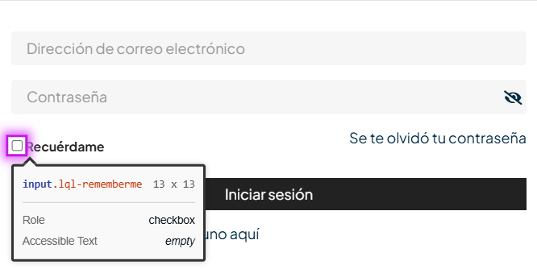

# 🐞 Reporte de Error

## ID  
**BUG-L001**

## Título  
**Inicio de sesión - La casilla de recordar contraseña debe tener una etiqueta accesible**

## Estado  
- [x] Nuevo  
- [ ] En revisión  
- [ ] En desarrollo  
- [ ] Resuelto  
- [ ] Cerrado  

## Reportado por  
**Daniel Pérez Morera**

## Fecha de detección  
**2025-10-22**

## Prioridad  
- ⚪ **Baja** (estética o detalle menor)

## Descripción  
La casilla para recordar la contraseña no tiene una etiqueta visible o accesible, lo que reduce la inclusión y la accesibilidad del sitio.

**Error detectado:** La casilla debe tener una etiqueta discernible.

## Pasos para reproducir  
1. Ir a la [página principal](https://roescr.com/).  
2. Presionar `Inicio de sesión rápida`.  
3. Observar la casilla de “Recordar contraseña”.

## Resultado esperado  
La casilla de recordar contraseña debe tener una etiqueta que indique claramente su función.

## Resultado obtenido  
La casilla de recordar contraseña no tiene una etiqueta visible o accesible.

## Evidencia  
- **Captura de pantalla:**  
    
- **Ticket de Axe Dev Tools:**  
  [Ver en Axe Dev Tools](https://axe.deque.com/issues/01901f52-6c77-4681-bec4-de583b44c91a)

## Entorno de pruebas  
- **Navegador:** Microsoft Edge 141  
- **Dispositivo:** Escritorio  
- **Sistema operativo:** Windows 11  
- **URL o versión del sistema:** [https://roescr.com/](https://roescr.com/)

## Notas adicionales  
Se recomienda agregar una etiqueta visible o un atributo accesible a la casilla para cumplir con los criterios de accesibilidad establecidos en las normas **WCAG 2.1 Nivel AA**.
