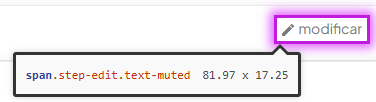
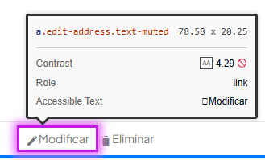
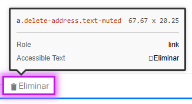
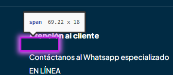

# 🐞 Reporte de Bug

## ID  
**BUG-P001**

## Título  
**Pago - Error en el contraste de colores con el fondo**

## Estado  
- [x] Nuevo  
- [ ] En revisión  
- [ ] En desarrollo  
- [ ] Resuelto  
- [ ] Cerrado  

## Reportado por  
**Daniel Pérez Morera**

## Fecha de detección  
**2025-10-22**

## Prioridad  
- ⚪ **Baja** (estética o detalle menor)

## Descripción  
Se han detectado varios elementos en la página de pago cuyo color no tiene suficiente contraste con el fondo, dificultando la legibilidad y afectando la accesibilidad del sitio.

**Error detectado:** Contraste de colores insuficiente entre texto o elementos interactivos y el fondo.

## Pasos para reproducir  
1. Iniciar sesión con un usuario válido.  
2. Agregar un producto al carrito.  
3. Hacer clic en el carrito y luego en `Pagar`.  
4. Observar los textos y botones en la página de pago.

## Resultado esperado  
Todos los textos y elementos interactivos deben tener un contraste suficiente con el fondo, asegurando su legibilidad y cumplimiento de accesibilidad.

## Resultado obtenido  
Varios elementos no cumplen con el contraste requerido, dificultando su lectura.

## Evidencia  
- **Capturas de pantalla:**  
    
    
    
    
- **Tiquetes de `Axe Dev Tools`:**  
  - [Tiquete 1](https://axe.deque.com/issues/0259121e-5f67-4e30-a1bd-e31497798bbb)  
  - [Tiquete 2](https://axe.deque.com/issues/7a36291b-9328-4f0b-bd60-85b4e40f5d57)  
  - [Tiquete 3](https://axe.deque.com/issues/5ea6a3c0-63a9-4e10-93c3-dbd4fdf0fa3e)  
  - [Tiquete 4](https://axe.deque.com/issues/6bce6592-8863-40d2-9b02-5c42033ade07)

## Entorno de pruebas  
- **Navegador:** Microsoft Edge 141  
- **Dispositivo:** Escritorio  
- **Sistema operativo:** Windows 11  
- **URL o versión del sistema:** [https://roescr.com/carrito?action=show](https://roescr.com/carrito?action=show)

## Notas adicionales  
Se recomienda ajustar los colores de texto y elementos interactivos para cumplir con los criterios de accesibilidad **WCAG 2.1 Nivel AA**, específicamente la regla de contraste de color.
