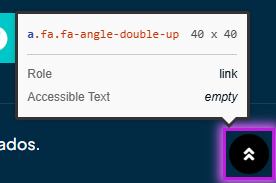

# 🐞 Reporte de Bug

## ID  
**BUG-P002**

## Título  
**Pago - Enlace sin texto legible**

## Estado  
- [x] Nuevo  
- [ ] En revisión  
- [ ] En desarrollo  
- [ ] Resuelto  
- [ ] Cerrado  

## Reportado por  
**Daniel Pérez Morera**

## Fecha de detección  
**2025-10-22**

## Prioridad  
- ⚪ **Baja** (estética o detalle menor)

## Descripción  
Se ha detectado un enlace en la página de pago que no contiene texto legible. Esto dificulta su identificación y afecta la accesibilidad del sitio para usuarios con lectores de pantalla.

**Error detectado:** Enlace sin texto legible.

## Pasos para reproducir  
1. Iniciar sesión con un usuario válido.  
2. Agregar un producto al carrito.  
3. Hacer clic en el carrito y luego en `Pagar`.  
4. Observar el enlace en la página de pago.

## Resultado esperado  
El enlace debe contener texto legible que describa su función, permitiendo su identificación y navegación correcta.

## Resultado obtenido  
El enlace carece de texto legible, dificultando su uso y accesibilidad.

## Evidencia  
- **Capturas de pantalla:**  
      
- **Tiquetes de `Axe Dev Tools`:**  
  - [Tiquete 1](https://axe.deque.com/issues/c0cfd5f9-b4f1-4824-9584-1900be23693d)  

## Entorno de pruebas  
- **Navegador:** Microsoft Edge 141  
- **Dispositivo:** Escritorio  
- **Sistema operativo:** Windows 11  
- **URL o versión del sistema:** [https://roescr.com/carrito?action=show](https://roescr.com/carrito?action=show)

## Notas adicionales  
Se recomienda agregar texto descriptivo al enlace para cumplir con los criterios de accesibilidad **WCAG 2.1 Nivel AA**, asegurando que sea claramente identificable.
